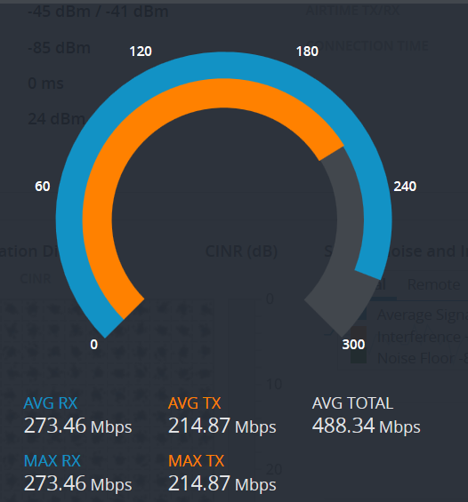

# Ubiquiti Winter Test

The test was to place a short-term permanent link between two balconies through the cold winter season to test the resilience of the node and gather data.

## Deployment on 16 December 2017

Two Ubiquiti LBE-5AC-23 devices were placed on balconies with direct line-of-sight between them:


The distance between the two nodes is approximately **375 m**. At that distance the antennas are almost not visible to the naked eye. This made pointing the antennas a bit of a guessing game. A signal strength of about **-40 dBm** was established.


## Node Construction

The radios were mounted on an ABS pipe stuck to a cinder block for support:


Each Ubiquiti device had an Orange Pi Zero with a 5 GHz TOP-GS07 radio as a companion cjdns device. These devices were connected to the Ubiquiti device via ethernet cable. The Ubiqiti was configured as PTP with network set to Bridge mode.

On one end of the link, the Orange Pi Zero and PoE connector were placed inside the apartment with the flat ethernet cable sliding under the balcony weather stripping and door, while the Ubiquiti device was left outside.

One the other side of the link, the Orange Pi Zero was placed in a dollar store tupperware container plugged into outdoor power outlets. The cables came out the bottom of the container, and the container was taped shut with the opening angled downward.


The latter node meshed over WiFi and cjdns to another node located indoors. That indoor node in turn meshed with an Internet-enabled Atom computer with WiFi capabilities. This provided a path to Hyperborea and the Internet.


## Orange Pi Zero Node-to-node Speed Test

At signal strength of about -40 dBm, the following speeds were obtained from iperf3 tests:

### Clear IPv4

```
[ ID] Interval           Transfer     Bandwidth       Retr
[  4]   0.00-60.00  sec   661 MBytes  92.5 Mbits/sec  106             sender
[  4]   0.00-60.00  sec   661 MBytes  92.4 Mbits/sec                  receiver
```

### cjdns

```
 [ ID] Interval           Transfer     Bandwidth       Retr
[  4]   0.00-10.00  sec  61.1 MBytes  51.3 Mbits/sec   94             sender
[  4]   0.00-10.00  sec  60.5 MBytes  50.7 Mbits/sec                  receiver
```

## Ubiquiti Radio-to-radio Speed Test



Tests between the pair of Ubiquiti devices alone showed speeds of **275 Mbps**. This is faster than tests involving the Orange Pi Zero's 10/100 ethernet and cjdns overheads. The speed measured here is consistent with results from earlier tests with the Ubiquiti devices, which are ~300 Mbps as well.

## Things Learned

* Both Ubiquiti antennas were set to the same LAN IP address of 192.168.1.20, which created an IP conflict on the bridged interface, so one was changed to 192.168.1.21

* A bad power brick for the Orange Pi Zero would prevent the WiFi and Mesh Point from working, and rebooting would bring it up for a very short period of time

* So far the outdoor node performed fairly well with outside temperatures dropping to -10 C, but node core temp never dropped below +8 C

* ABS tubing is not very riget and bend fairly easily, making the antenna sway slightly in windy conditions

* Wireless link through a balcony door and screen has a decent signal strength but horrible throughput

## Poor Performance Between Outdoor and Indoor Nodes

Very poor speeds were observed between an outdoor node with the first indoor node. Note that this occurs in the part of the network outside of the Ubiquiti devices, involving only the TOP-GS07 devices over Mesh Point:

```
[  4] local fc5e:44cd:6af4:4afc:cc4e:a75c:89a5:8d23 port 48622 connected to fc04:8b29:9889:cf83:88c:80fc:9e3b:78b4 port 5201
[ ID] Interval           Transfer     Bandwidth       Retr  Cwnd
[  4]   0.00-1.00   sec   244 KBytes  2.00 Mbits/sec   12   13.2 KBytes
....
[  4]  58.00-59.00  sec   125 KBytes  1.02 Mbits/sec    1   21.7 KBytes
[  4]  59.00-60.00  sec   250 KBytes  2.05 Mbits/sec    1   20.5 KBytes
- - - - - - - - - - - - - - - - - - - - - - - - -
[ ID] Interval           Transfer     Bandwidth       Retr
[  4]   0.00-60.00  sec  9.12 MBytes  1.28 Mbits/sec  252             sender
[  4]   0.00-60.00  sec  8.98 MBytes  1.26 Mbits/sec                  receiver
```

The following steps were attempted to diagnose the issue:

* Replaced inside node with new node and TP-LINK TL-WN722N adapter (no improvement)
* Moved inside node outside (no improvement)
* Moved node inside (slight improvement to 3-4 Mbps)
* Removed top of tupperware container (no improvement)
* Signal strength during this whole time has been above -55 dBm
* Speed test against different node slightly farther registered 15 Mbps
* Suspecting of bad radio, replaced USB radio with new module (issue remains)
* Suspecting of bad power brick, replaced power brick (issue remains)
* Change one of the inside nodes to a "low-profile cased fanless" Orange Pi Zero with TP-LINK TL-WN722N WiFi adapter but kept the SD card to preserve settings (issue remains)

Notes:

* On 16 December 2017, patched a Node Exporter hack to collect Ubiquiti data from SNMP using the Orange Pi Zero nodes
* On 20 December 2017, moved the Orange Pi Zero node inside, link quality improved and metrics started recording correctly
* On 22 December 2017, further tests found that there may be an issue with the 3D-printed cases... when hardware is outside the case, speeds reach 30 Mbps, and placing it back in the case drops the speeds to 5 Mbps
* On 23 December 2017, moved one of the receivers down to below the balcony line so the signal is going _through_ the balcony glass, signal degraded minimally and speeds remained consistent